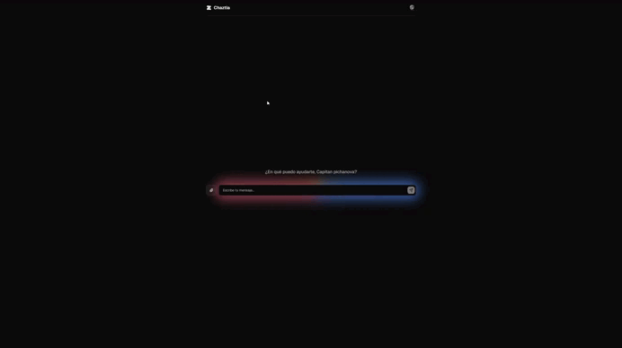

<h1 align="center">
  <span style="color:#4285F4">💬</span>
  <span style="color:#FFFFFF"> Chazt</span><span style="color:#9B72CB">Ia</span>
</h1>

<p align="center">
  Por si quieres ver — <a href="https://chaztia.vercel.app"><strong>Live Demo</strong></a>
</p>

<p align="center">
  
</p>

### Documentación técnica

<p align="left">
  <a href="docs/ChaztIa%20-%20Documentacion%20Tecnica.pdf"><strong>📄 Documentación Técnica (PDF)</strong></a>
  <br/>
  <a href="docs/ChaztIa%20-%20Manual%20de%20Usuario.pdf"><strong>📘 Manual de Usuario (PDF)</strong></a>
</p>

---

## ¿Qué es este proyecto?

**ChaztIa** es una aplicación web personal (sin fines comerciales) de chat conversacional con inteligencia artificial. Permite:

- Chatear con un asistente de IA a través de una interfaz simple y moderna, con soporte de tema **claro/oscuro**.
- Adjuntar **imágenes y archivos** (texto, código, PDF, Word) como contexto adicional para la conversación, con vista previa antes de enviar.
- Ver las respuestas del asistente con **formato enriquecido**: Markdown, bloques de código con lenguaje resaltado, listas, enlaces.
- Personalizar el nombre con el que la IA se dirige al usuario y una foto de perfil.
- Iniciar una nueva conversación en cualquier momento.

No hay sistema de cuentas ni backend propio de usuarios: **no existe login, registro ni base de datos**. El nombre, la foto de perfil y el tema se guardan en `localStorage`; los mensajes y los archivos adjuntos viven solo en memoria durante la sesión y se pierden al recargar la página, por diseño.

El modelo de lenguaje se consulta a través de la **API de Groq**, mediante una función serverless propia (carpeta `api/`) que oculta la API key al cliente.

---

## Tecnologías utilizadas

| Categoría | Tecnología |
|---|---|
| Framework | React 19 |
| Lenguaje | TypeScript |
| Build tool | Vite |
| Estilos | Tailwind CSS v4 |
| Componentes UI | shadcn / Base UI |
| Markdown | react-markdown + remark-gfm |
| Iconos | lucide-react |
| Tipografía | Geist Variable (@fontsource) |
| Backend | Función serverless (`@vercel/node`) que hace de proxy a la API de Groq |
| IA | Groq API (modelo `openai/gpt-oss-120b`) |
| Deploy | Vercel |

---

## Estructura del proyecto

```
api/
└── chat.ts                  # Función serverless: proxy a la API de Groq (oculta la API key)

docs/                        # Documentación técnica y manual de usuario (PDF/DOCX)

src/
├── main.tsx                 # Punto de entrada de React
├── App.tsx                  # Componente raíz: estado y lógica del chat
├── index.css                # Tema (claro/oscuro), variables de color, animaciones
├── components/
│   ├── chat-markdown.tsx    # Render de Markdown (texto, código) en los mensajes
│   └── ui/                  # Componentes shadcn (Button, Input, Card, Dialog, Avatar...)
└── lib/
    └── utils.ts             # Helper cn() (clsx + tailwind-merge)
```

---

## Cómo iniciar el proyecto

### Requisitos previos

- Node.js 20+
- npm
- Una [API key de Groq](https://console.groq.com/keys)

### Instalación

```bash
npm install
```

### Variables de entorno

Copia `.env.example` a `.env` y agrega tu API key de Groq (solo se usa en la función serverless de `api/`, nunca se expone al cliente):

```bash
GROQ_API_KEY=tu_api_key_aqui
```

### Desarrollo local

```bash
npm run dev
```

La app arranca en `http://localhost:5173` por defecto (sirve solo el frontend; para probar también la función `api/chat.ts` usa `vercel dev`, que arranca el proxy de Groq junto con Vite).

### Build de producción

```bash
npm run build
```

### Preview del build

```bash
npm run preview
```

### Lint

```bash
npm run lint
```

---

## Deploy

El proyecto está pensado para desplegarse en **Vercel**: detecta automáticamente el framework Vite (build y función serverless en `api/`). Solo hace falta configurar la variable de entorno `GROQ_API_KEY` en el dashboard del proyecto (o con `npx vercel env add GROQ_API_KEY`) y ejecutar `npx vercel --prod`.

---
